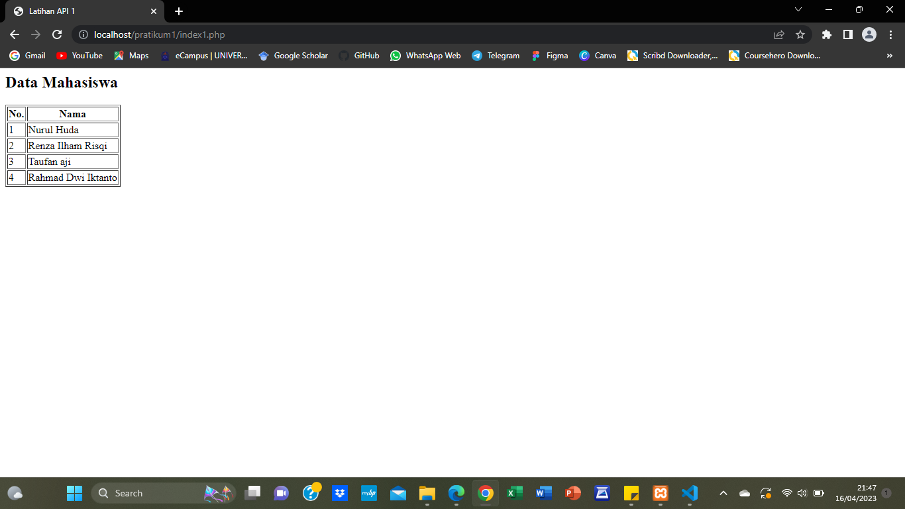
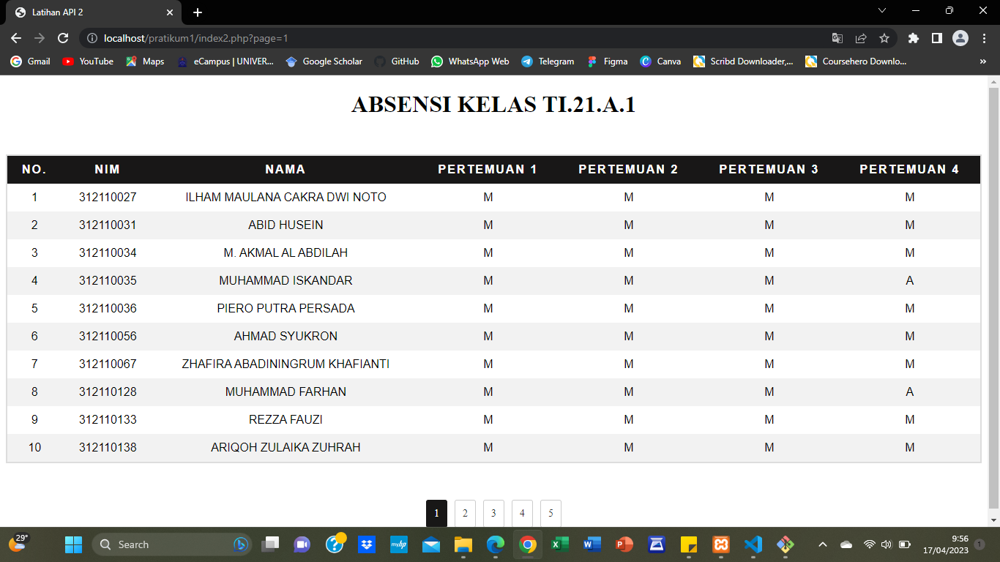

# Tugas 1 - Latihan API

## Latihan 1

Pada latihan 1 adalah contoh menarik api ke website, link API-nya adalah (https://tifupb.id/data), terdiri dari 4 data yang berisikan nama-nama mahasiswa. Data API tersebut kemudian ditampilkan pada website menggunakan bahasa pemograman PHP.

## Latihan 2

Latihan yang kedua ini adalah lanjutan dari latihan 1 menarik api ke website, link API-nya adalah (https://tifupb.id/tugas1). Berbeda dengan API Latihan 1, link API tersebut memiliki banyak data, dan di tampilkan ke sebuah website menggunakan bahasa pemograman PHP serta menambahkan CSS pada baris kodenya agar terlihat menarik.

### Terima Kasih!